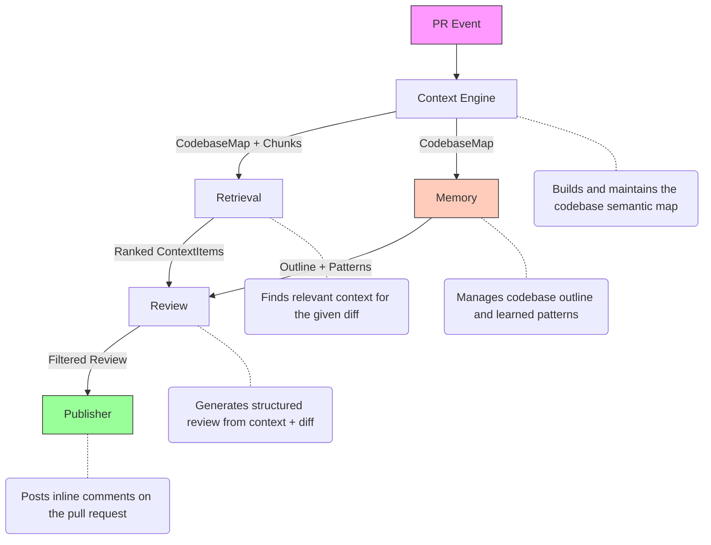
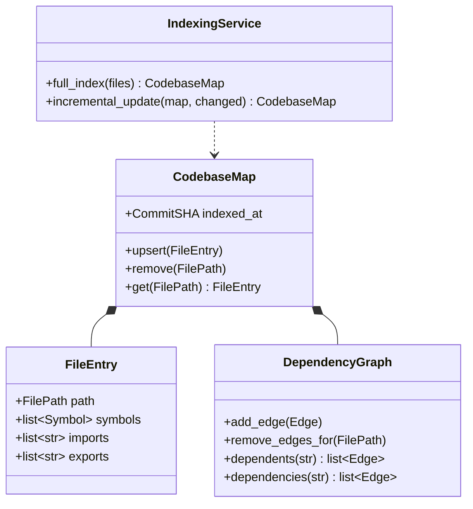
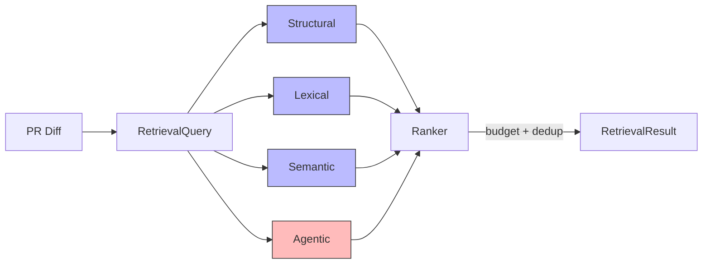
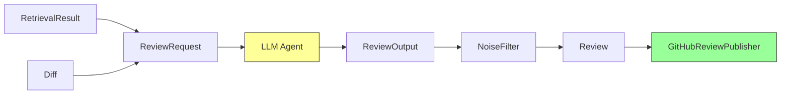
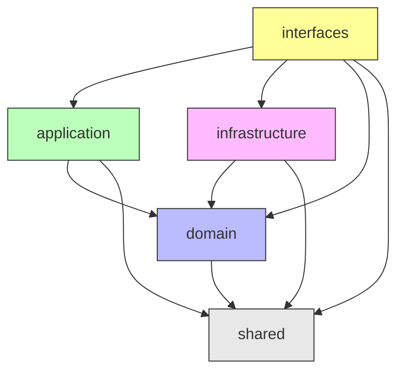
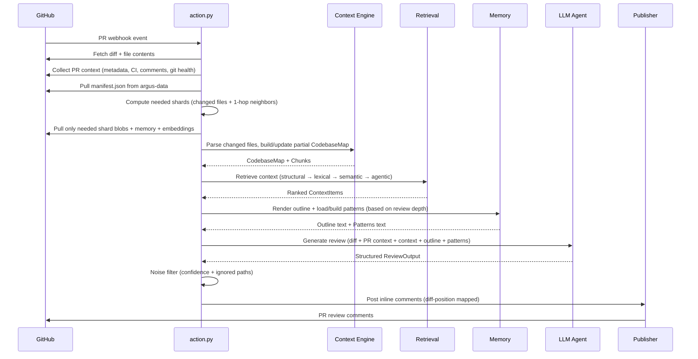

# Architecture

## Overview

Argus is designed as a pipeline with five bounded contexts: **Context**, **Retrieval**, **Memory**, **Review**, and **LLM**. Each context owns its domain logic, exposes well-defined interfaces, and knows nothing about the others' internals.



---

## Bounded Contexts

### 1. Context Engine

Responsible for building, updating, and versioning the semantic map of a codebase.



**Core Concepts:**

- **CodebaseMap** — The aggregate root. Represents the complete semantic understanding of a repository at a point in time. Contains file entries and the dependency graph. Versioned by commit SHA. A partial map assembled from selected shards is indistinguishable from a full map with fewer files.
- **FileEntry** — An entity representing a single source file. Holds its AST-derived structure (functions, classes, exports) and its relationships to other files.
- **DependencyGraph** — A value object representing the directed graph of relationships between symbols: imports, calls, extends, implements. Built entirely from AST parsing — no LLM required.
- **ShardedManifest** — DAG index for sharded storage. Maps shard IDs (directory paths) to descriptors and tracks cross-shard dependency edges. Provides `shards_for_files()`, `adjacent_shards()` (BFS), and `dirty_shards()` for selective loading.
- **ShardId** — A `NewType` over `str`, derived deterministically as the POSIX parent directory of a file path.
- **Checkpoint** — A value object that snapshots the CodebaseMap at a specific version.

**Behaviors:**

- **Full index** — Walks the entire repository, parses every file, builds the complete map. Triggered when no prior context exists.
- **Incremental update** — Given a set of changed files (from the PR diff), re-parses only those files and updates their entries and edges in the graph. The rest of the map is preserved.

**Invariants:**

- The dependency graph must always be consistent with the file entries. If a file is removed, all edges involving it are removed.
- Every file entry must have been parsed from source.
- Checkpoints are immutable once created.

---

### 2. Retrieval

Responsible for finding the right context to inform a review. This is the intelligence layer — it decides *what the reviewer needs to know* about the codebase to evaluate a diff.



**Core Concepts:**

- **RetrievalQuery** — A value object encoding what we're looking for: changed files, changed symbols, diff text.
- **RetrievalResult** — Ranked, budgeted context items ready for the review generator.
- **RetrievalStrategy** — A protocol. Multiple strategies exist and compose.

**Strategies (layered, not competing):**

1. **Structural retrieval** — Walks the dependency graph. Collects direct dependents, direct dependencies, and co-located files. Deterministic, instant, highest signal.
2. **Lexical retrieval** — BM25 sparse search over AST-chunked code. Handles identifier lookups and pattern matching. Useful when the structural graph doesn't capture a relationship.
3. **Semantic retrieval** — Embedding-based cosine similarity against pre-computed indices. Captures conceptual relationships that structural and lexical strategies miss. Requires an embedding model to be configured (`embedding_model`). Supports Google, OpenAI, and local (sentence-transformers) providers.
4. **Agentic retrieval** — The LLM itself acts as a retriever. It reads the diff, reasons about intent, and issues targeted queries against the other tiers. Most expensive, used adaptively.

**Context Budgeting:**

Retrieval results are subject to a token budget split across tiers. The ranker fills the budget greedily by relevance score until exhausted.

**Invariants:**

- Retrieval must never exceed the configured token budget.
- Structural retrieval always runs. Other tiers are additive.
- Results must be deduplicated — the same code chunk cannot appear twice.

---

### 3. Review

Responsible for generating a structured review from the diff and retrieved context, then deciding how to present it.



**Core Concepts:**

- **PRContext** — Enriched PR metadata: title, body, author, labels, CI status (check runs), git health (behind-by, merge commits, days open), prior comments, and optionally related issues/PRs. Collected by `PRContextCollector` in infrastructure and passed through to the review prompt.
- **ReviewRequest** — Bundles the PR diff, retrieved context, and optional PR context.
- **Review** — The aggregate root. Contains a summary and a collection of review comments.
- **ReviewComment** — A single finding with location (file, line range), severity (critical, warning, suggestion, praise), category (bug, security, performance, style, architecture), confidence score, and suggested fix.
- **ReviewSummary** — High-level assessment: what the PR does, risks, strengths, and verdict.

**Behaviors:**

- **Generation** — Diff + PR context + retrieved context assembled into a prompt, sent to LLM, response parsed into structured `ReviewOutput`. PR context enables holistic assessment: CI failures, stale PRs, unaddressed reviewer feedback, and poor descriptions.
- **Noise filtering** — Comments below confidence threshold are dropped. Findings on ignored paths are dropped.
- **Severity calibration** — Explicit severity classification distinguishes "this will break production" from "consider renaming this variable."

**Invariants:**

- A review with zero findings still produces a summary.
- Every comment must reference a specific file and line range from the diff.
- Comments must be actionable with concrete suggestions.

---

### 4. Memory

Responsible for maintaining persistent codebase understanding across reviews. Provides structural outlines and learned coding patterns that enrich the review context.

**Core Concepts:**

- **CodebaseMemory** — The aggregate root. Bundles a codebase outline with learned patterns, versioned for staleness tracking. Tracks `analyzed_at` (the commit SHA where patterns were last analyzed) independently of `indexed_at` to prevent history divergence between index and bootstrap modes.
- **CodebaseOutline** — An AST-derived structural summary of the codebase, scoped to changed files and their blast radius (dependents + dependencies).
- **PatternEntry** — A single learned coding pattern with category (style, naming, architecture, etc.), description, confidence score, and examples.
- **ProfileService** — Orchestrates building and updating memory profiles. Prunes low-confidence patterns and caps total entries.
- **PatternAnalyzer** — A protocol for LLM-based pattern discovery from codebase outlines.

**Review Depth Levels:**

Memory inclusion is controlled by review depth:
- **quick** — No memory context. Fastest, lowest cost.
- **standard** — Codebase outline included. Gives the LLM structural awareness.
- **deep** — Outline + learned patterns. Full codebase understanding with convention enforcement.

**Budget-Aware Prompt Assembly:**

The review generator prioritizes sections within the token budget: diff (always) > PR context > retrieved context > outline > patterns. Lower-priority sections are dropped with logging when they'd exceed the budget.

**Pattern Analysis:**

Patterns can be analyzed in two ways:
- **Bootstrap** (`bootstrap.py`) — Full rebuild: fetches the entire repository tree, parses all source files, renders a complete outline, and runs LLM pattern analysis. Sets `analyzed_at` to the current HEAD SHA.
- **Index** (`sync_index.py`) — Incremental: when `analyze_patterns = true` in config, after updating the codebase map, pulls existing memory, renders a scoped outline for changed files (used for LLM analysis only), preserves the full existing outline in storage, and runs incremental pattern analysis. Sets `analyzed_at` to the push HEAD SHA.

Bootstrap uses `analyzed_at` (falling back to `indexed_at`) as the diff base for incremental analysis, ensuring no changes are missed even when index mode has advanced `indexed_at`.

**Invariants:**

- Patterns below the minimum confidence threshold (0.3) are pruned.
- Total patterns are capped at 30 entries, sorted by confidence.
- Outline rendering respects a character budget derived from the token budget.

---

### 5. LLM

Responsible for abstracting all interactions with language models behind a uniform interface.

**Core Concepts:**

- **ModelConfig** — A value object holding the pydantic-ai model string (e.g. `anthropic:claude-sonnet-4-5-20250929`), max_tokens, and temperature.
- **TokenBudget** — Available context window split between retrieval and generation with configurable ratios.

**Provider Abstraction:**

All LLM calls go through pydantic-ai. The system supports any provider pydantic-ai supports — Anthropic, OpenAI, Google, Groq, and any OpenAI-compatible endpoint (LM Studio, Ollama, vLLM). The rest of the system never knows which provider is active.

---

## Cross-Cutting Concerns

### Storage

The CodebaseMap is persisted between runs using **sharded DAG storage**. The domain defines `CodebaseMapRepository` and `ShardedMapRepository` protocols; infrastructure provides `ShardedArtifactStore` (primary) and `FileArtifactStore` (legacy fallback).

**Sharded format** (on the `argus-data` branch):

```
argus-data branch:
  manifest.json              # DAG index: shard descriptors + cross-shard edges
  shard_<content_hash>.json  # One per leaf directory
  <hash>_memory.json         # Patterns + outline (unchanged)
  <hash>_embeddings.json     # Pre-computed embedding vectors per shard
```

- **manifest.json** — Maps shard IDs (directory paths) to descriptors (file count, content hash, blob name) and tracks cross-shard dependency edges.
- **Shard files** — Each contains the serialized `FileEntry` objects and internal edges for files in one directory.
- **Shard ID** — Derived deterministically from `PurePosixPath(file_path).parent`.

**Selective loading:**

- **Review** pulls only the manifest, computes needed shards (changed files + 1-hop dependency neighbors via BFS on cross-shard edges), and downloads only those shard blobs. Optionally pulls embedding indices for semantic retrieval when `embedding_model` is configured.
- **Index** pulls the manifest, determines dirty shards from changed files, downloads only those, updates, and re-shards. Optionally pulls memory blobs and runs incremental pattern analysis when `analyze_patterns` is enabled. Optionally rebuilds embedding indices for changed shards when `embedding_model` is configured.
- **Bootstrap** builds the full map, splits into shards, and saves everything. Optionally builds embedding indices for all shards when `embedding_model` is configured.

`ShardedArtifactStore` also satisfies `CodebaseMapRepository` via `load()` / `save()` methods, which delegate to `load_or_migrate()` (tries sharded, falls back to legacy flat format) and `save_full()` (always writes sharded). Legacy flat artifacts are cleaned up on first sharded save.

Codebase memory (outlines + patterns) is persisted separately via `FileMemoryStore` with file locking for concurrent access. The `analyzed_at` field on `CodebaseMemory` is serialized/deserialized alongside patterns and outline, enabling index mode to track where it last analyzed without conflating with `indexed_at`.

### Parsing

AST parsing is an infrastructure concern. The domain defines a `SourceParser` protocol; infrastructure implements it with tree-sitter grammars for 11 languages.

### Configuration

All configurable values live in `[tool.argus]` in `pyproject.toml`. The domain does not read environment variables or TOML files. Configuration is loaded at the interfaces layer (`toml_config.py`) and injected as value objects. Only secrets and GitHub runtime vars remain as environment variables.

---

## Layer Dependency Flow



- **shared** is the foundation. Every layer may import from it. Zero internal imports.
- **domain** imports only from **shared**. Defines protocols that infrastructure satisfies.
- **application** imports **domain** to orchestrate services and access entities.
- **infrastructure** imports **domain** to implement protocols.
- **interfaces** imports from all layers. Constructs implementations, injects them into use cases, runs the pipeline. This is the only place that knows about all layers simultaneously.

---

## Full Pipeline Flow



---

## Module Structure

```
src/argus/
├── shared/                          # Foundation kernel — types, exceptions, constants
├── domain/                          # Pure domain logic — depends only on shared/
│   ├── context/                     # Context Engine bounded context
│   ├── retrieval/                   # Retrieval bounded context
│   ├── memory/                      # Memory bounded context (outline + patterns)
│   ├── review/                      # Review bounded context
│   └── llm/                         # LLM bounded context
├── application/                     # Use cases — orchestrates domain services
├── infrastructure/                  # Concrete implementations of domain protocols
│   ├── parsing/                     # Tree-sitter AST parser + code chunker
│   ├── retrieval/                   # Structural, lexical, semantic, agentic strategies
│   ├── memory/                      # Outline renderer + LLM pattern analyzer
│   ├── llm_providers/              # pydantic-ai Agent factory
│   ├── storage/                     # Sharded codebase map + memory persistence
│   └── github/                      # GitHub API client + review publisher
└── interfaces/                      # Entry points — action, bootstrap, config
```

---

## Design Principles

- **The domain has no dependencies.** It defines interfaces; infrastructure implements them. The domain never imports from infrastructure, never calls an API, never reads a file.
- **Value objects are immutable.** Once created, they don't change. New state means new objects.
- **Side effects live at the boundary.** LLM calls, GitHub API calls, artifact uploads — all happen in infrastructure, orchestrated by application services.
- **Retrieval is composable.** Strategies are independent and layered. Adding a new retrieval tier means implementing the strategy interface and registering it. Nothing else changes.
- **Failure is explicit.** Typed exceptions with structured context flow upward. The application layer catches at use-case boundaries and decides whether to retry, degrade gracefully, or abort.
